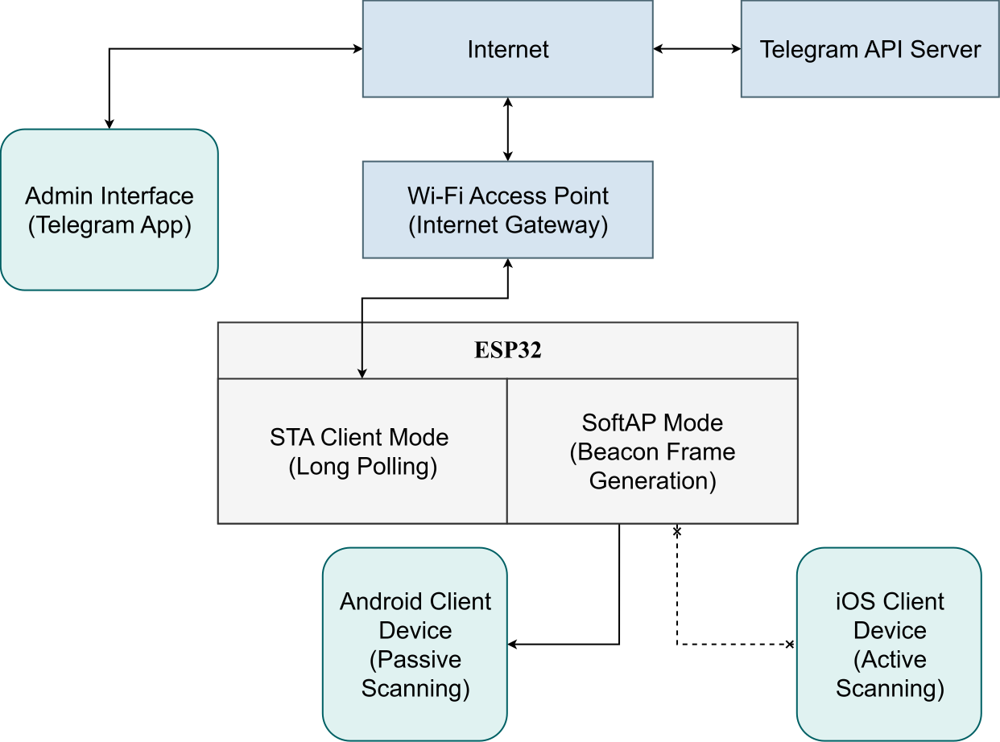

# Wi-Fi Cafe

An interactive, zero-app queue management system that broadcasts order progress directly to guests' smartphones via dynamic Wi-Fi SSIDs, controlled via a private Telegram bot on an ESP32.

[](https://doi.org/10.5281/zenodo.22865565)


**[Watch demo video on YouTube](https://youtu.be/sZdIltr857k)**

## Quick Start

Flash the firmware to your ESP32 in three steps:

```bash
git clone https://github.com/egraich/wifi-cafe.git
cd wifi-cafe
cp config.example.h src/config.h
```

Fill in your Wi-Fi and Telegram credentials in `src/config.h`, then flash the board as shown in the [guide](https://docs.platformio.org/en/latest/core/quickstart.html#process-project).

Power the ESP32 from any USB source. The onboard status LED will turn off and the bot will send a ready message to Telegram as soon as it establishes an Internet connection.

## Features

* **Zero-Install Client Interface:** Guests check their order status directly from their phone's native Wi-Fi settings menu (e.g., `Alex: 40%`) with no apps, logins, or QR code scans.
* **Chefs' Telegram Controller:** Manage queue items using interactive inline buttons (`[ ⬅️ ]`, `[ ➡️ ]`, `[ 🗑 DELETE ]`) with automated chat cleanup (FSM).
* **Fast Order Creation:** Supports instant order injection via `/new <Name>` or guided creation via `/new`.
* **Universal 2.4 GHz Connectivity:** Connects to any standard Wi-Fi network with Internet access — home/cafe routers, dedicated access points, or mobile hotspots.
* **Fully Portable:** Can be powered by an ordinary USB powerbank for outdoor deployment.

## OS Compatibility (Important)

* **Android:** Works perfectly. Android uses Passive Scanning, immediately displaying dynamically generated 802.11 Beacon frames in the native Wi-Fi menu.
* **iOS / Apple Devices:** Currently unsupported. iOS enforces strict Active Scanning. It drops all Wi-Fi networks that do not reply to `Probe Request` packets with a valid `Probe Response`. Since this firmware only performs one-way Beacon frame injection without a full AP state machine, iOS devices will silently ignore the orders.

## How to Run It Locally

### Prerequisites

* VS Code with the [PlatformIO IDE extension](https://platformio.org/).
* ESP32 Development Board (e.g., ESP32 Dev Module / NodeMCU-32S).
* Any 2.4 GHz Wi-Fi network with Internet access (home router, cafe Wi-Fi, or smartphone hotspot).

### Configuration

Copy the configuration template `config.example.h` to `src/config.h`:

```bash
cp config.example.h src/config.h
```

Open `src/config.h` and supply your network and Telegram credentials:

```cpp
#pragma once

constexpr const char* WIFI_SSID = "YOUR_WIFI_SSID";
constexpr const char* WIFI_PASS = "YOUR_WIFI_PASSWORD";
constexpr const char* BOT_TOKEN = "YOUR_TELEGRAM_BOT_TOKEN";
constexpr const char* ADMIN_ID  = "YOUR_TELEGRAM_USER_ID";

#ifndef LED_BUILTIN
constexpr uint8_t LED_BUILTIN = 2;
#endif
```

> **Note:** `src/config.h` is ignored by Git (`.gitignore`) to keep your personal credentials safe.

### Build & Upload

1. Open the project folder in VS Code / PlatformIO.
2. Connect your ESP32 board via USB.
3. Build and flash the project following the [guide](https://docs.platformio.org/en/latest/core/quickstart.html#process-project).
4. Ensure your 2.4 GHz Wi-Fi network is active.
5. The onboard status LED will blink every 200 ms while negotiating the Wi-Fi connection and shut off once ready.

## How It Works

The system operates across two isolated data paths on a single physical 2.4 GHz radio: an HTTPS control plane for administration and a raw 802.11 broadcast plane for status transmission.

### System Architecture



The diagram above illustrates the end-to-end communication flow:

* **Control Path (Telegram → ESP32):** Admin interactions in the Telegram app travel over HTTPS to the Telegram API Server, which routes updates to the ESP32 operating in `STA` mode through an existing Wi-Fi gateway.
* **Broadcast Path (ESP32 → Guests):** The ESP32's `SoftAP` mode generates raw 802.11 Beacon frames containing updated SSIDs. Android devices passively pick up these frames and display progress in real time, while iOS devices ignore them due to active probe requirements.

### Dual-Interface Network Operation (AP + STA)
The ESP32 operates in `WIFI_AP_STA` mode. It connects as a Station (STA) to an existing Wi-Fi network or mobile hotspot to handle HTTPS long-polling to the Telegram Bot API. Concurrently, a hidden SoftAP interface is initialized on the exact same radio channel to obtain an active transmit handle (`WIFI_IF_AP`).

### Raw 802.11 Beacon Injection
Standard Wi-Fi SDKs only support hosting a single SSID. To overcome this limitation, the firmware uses the low-level ESP-IDF `<esp_wifi.h>` API (`esp_wifi_80211_tx`) to craft and broadcast raw 802.11 management beacon frames every 100 ms for each active order. The payload contains dynamically formatted SSID tags (`Name: XX%`), supported rate definitions, and dynamic DS parameter sets matching the active channel.

### Memory & Execution Budget
The active order list is stored in RAM using `std::vector<Order>`. Progress values use `uint8_t` (0–100%) to conserve SRAM, and strings are constrained to the standard 32-byte 802.11 SSID length limit with automated suffix byte reservation (`: 100%`).

## Credits

* **[FastBot](https://github.com/GyverLibs/FastBot)** by AlexGyver — An exceptionally lightweight, non-blocking Telegram Bot library for ESP32/ESP8266. Its zero-overhead polling and built-in inline keyboard/callback routing made building responsive UI cards on embedded hardware seamless.
* **Espressif Systems** — For providing raw 802.11 packet transmission capabilities within the ESP-IDF networking stack.

[Read Project Story](https://github.com/egraich/WiFi-cafe/blob/main/docs/ProjectStory.md)

Made by [egraich](https://egraich.dev) <3